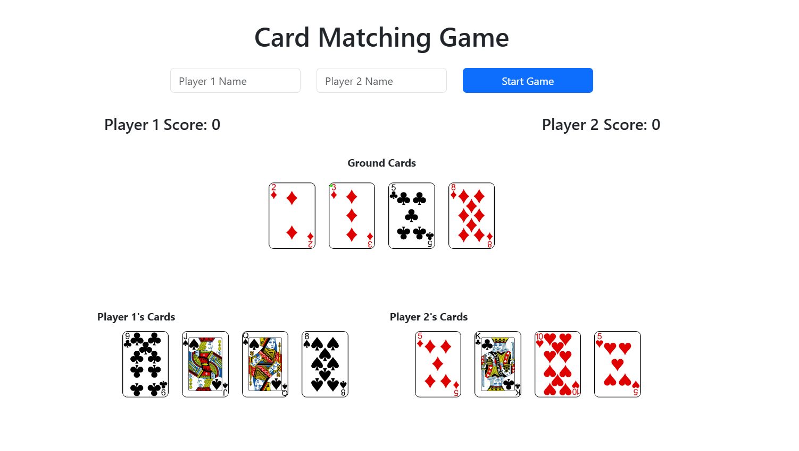

# Card Matching Game

Card Matching Game is a web-based game for two players to match pairs of cards by dragging and dropping. It features player name input, score tracking, and a responsive design using Bootstrap. Built with HTML, CSS, and JavaScript, it offers an engaging way to test memory and concentration skills.

## Features

- Two-player game
- Player name input
- Score tracking for each player
- Drag and drop functionality for cards
- Responsive design using Bootstrap

## Technologies Used

- HTML
- CSS
- JavaScript
- Bootstrap 5.3.3

## Getting Started

### Prerequisites

To run this project, you need a web browser that supports HTML5, CSS3, and JavaScript.

### Installation

1. Clone the repository:
    ```bash
    git clone https://github.com/yourusername/card-matching-game.git
    ```
2. Navigate to the project directory:
    ```bash
    cd card-matching-game
    ```

### Running the Game

Open the `index.html` file in your web browser to start the game.

### Game Rules

1. Enter the names of Player 1 and Player 2.
2. Click the "Start Game" button.
3. Each player takes turns dragging and dropping their cards onto the ground area.
4. If a player matches a pair of cards, their score increases.
5. The game continues until all pairs are matched.
6. The player with the highest score wins.

## File Structure

- `index.html`: The main HTML file for the game.
- `style.css`: The CSS file for styling the game.
- `script.js`: The JavaScript file for game logic and interactivity.
- `README.md`: This file.

## Screenshots



## Contributing

Contributions are welcome! Please open an issue or submit a pull request for any improvements or bug fixes.

## License

This project is licensed under the MIT License. See the `LICENSE` file for details.

## Acknowledgements

- Bootstrap: [https://getbootstrap.com/](https://getbootstrap.com/)

## Contact

If you have any questions or feedback, feel free to contact me at [nadyahmd88@gamil.com](mailto:nadyahmd88@gamil.com).
